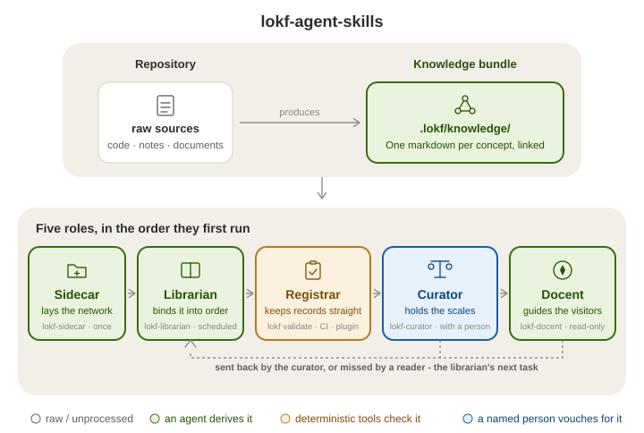
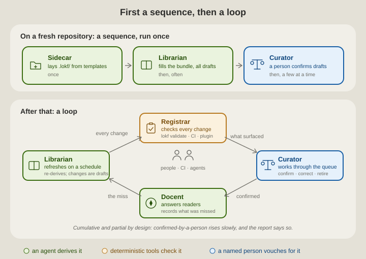
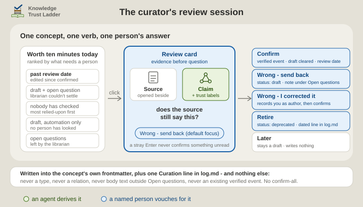
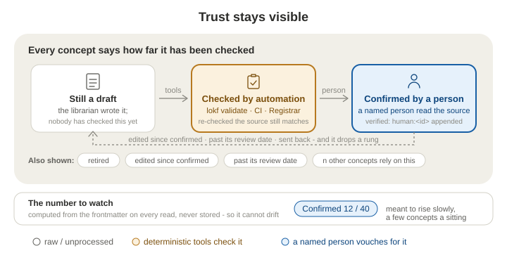

# LOKF Agent Skills

> "We lasso the world with networks of silver-coloured Italian hemp,\
> We bind down the world into some sort of order;\
> We balance the earth in a pair of scales of our own devising."\
> — Amy Lowell, *The Congressional Library* (1922)

Four [Agent Skills](https://agentskills.io/home) that turn a repository's scattered knowledge into a maintained, trusted asset using **[LOKF](https://lokf.nolan-nichols.com/)** (Linked Open Knowledge Format) - a semantic profile of OKF in which a plain folder of Markdown concept files carries enough meaning to be validated by schema, queried as a graph, and read by people and agents alike. The [`lokf`](https://pypi.org/project/lokf) Python package provides the schema and the tooling. **An agent derives it. Deterministic tools check it. A named person vouches for it. The bundle records which of the three happened to every claim.**

<p align="center">
  
</p>

> **Two ways in.** This README is one; the other is a docent. Install
> [`lokf-docent`](skills/lokf-docent/SKILL.md) into whatever agent you already
> use - `npx skills add noelmcloughlin/lokf-agent-skills --skill lokf-docent --yes` -
> and ask it anything about this project: *Which skill do I run first?*, say,
> or *How do lokf-librarian and lokf-curator relate?* It answers from
> `.lokf/knowledge/`, the checked part of what the project knows, and says how
> far each answer has been trusted. [EXAMPLES.md](EXAMPLES.md) shows eight such
> answers, captured, not invented. **Agents:** if `.lokf/knowledge/index.md`
> exists, read it first - `llms.txt` says how to weigh it.

## Why libraries have catalogues

The knowledge already exists - in code, documents, diagrams, policies, operational records. What's missing is a layer that sits between those sources and whoever needs them next, and stays put. Without it, every task starts the same way: find the material, work out how it connects, judge what's still true. That's real work, and the collected context dies with the task - the next person, or next conversation with an assistant, pays for it again.

A **knowledge bundle** - that folder of concept files - is the catalogue: it keeps the work instead of discarding it. But a catalogue is only worth keeping if you can tell which entries are sound. Otherwise you re-verify everything yourself, the very thing you were trying to avoid, and the files quietly rot.

So every answer from the bundle says where it came from and how far it has been checked, in plain words: *confirmed by a person*, or *nobody has checked this yet*. The labels are listed under [Trust stays visible](#trust-stays-visible).

## Four roles, three lines of the poem

| Skill | Role | Runs |
| --- | --- | --- |
| [`lokf-sidecar`](skills/lokf-sidecar/SKILL.md) | **Sidecar** - *lays the network*. Bootstraps a fresh `.lokf/` sidecar (tooling, docs, dummy skeleton) into a repository that doesn't have one, from bundled templates; repairs a broken sidecar file. | once |
| [`lokf-librarian`](skills/lokf-librarian/SKILL.md) | **Librarian** - *binds it into order*. Scrapes the repository, derives concepts with their sources, classifies them, wires typed relationships, audits, and hands off for review. Like a real librarian it catalogues without vouching: it deals in *facts about the repository*, never in verdicts about truth. | often, including on a schedule |
| [`lokf-curator`](skills/lokf-curator/SKILL.md) | **Curator** - *holds the scales*. A human curator's assistant. Shows what needs a person's look, puts the source next to the claim, and records the person's verdict - confirm, correct, retire, send back - in the bundle's own frontmatter. It deals in *judgments a person made*, never in facts it derived. | a little, regularly |
| [`lokf-docent`](skills/lokf-docent/SKILL.md) ([examples](EXAMPLES.md)) | **Docent** - *guides the visitors*, the role the poem leaves implicit, because the library exists for them. Answers from the bundle first, says how far each concept used has been trusted, verifies exact values at the source, and when the bundle has no answer explores the repository and records the miss so it becomes the librarian's next task. Read-only on the bundle. | whenever anyone asks |

**Curator** is the museum sense of the word - the one who authenticates, weighs provenance, and decides what is put on exhibit - not the data-management sense, which is the **librarian**'s job. A **docent** is the museum's guide, who explains the exhibition without moving anything on the shelves. In short: the **librarian** reports, the **curator** fact-checks and edits, the **docent** reads, and writes back what the bundle missed.

On a fresh repository they run in that order: the **sidecar** once, then the **librarian** filling the bundle and marking everything it creates a draft, then the **curator**, where a person turns drafts into confirmed knowledge a few at a time. After that it stops being a sequence and becomes a loop: the **librarian** refreshes on a schedule, readers send back what the bundle missed, and the **curator** works through whatever that surfaces.

<p align="center">
  
</p>

### The fifth role, which is not a skill

The one job none of the four does is the **registrar**'s: keeping the records themselves in order - each accession properly documented, the provenance paperwork filed, nothing entered in a form the catalogue can't read. It is clerical work, and no person has to do it. In a repository the `lokf` toolkit does it on every change, and CI's [`knowledge-registrar.yaml`](.github/workflows/knowledge-registrar.yaml) does it again on every pull request that touches the bundle - where it also checks that each new confirmation is backed by that person's approval of the pull request, or their signature on the commit that recorded it, because a claim that a named person checked something has to be tied to that person.

In [Obsidian](https://obsidian.md/) there is no CI, so for anyone who edits a bundle by hand there, two plugins do the desk work ([The bundle in Obsidian](docs/obsidian.md)):

| Plugin | Role at the desk |
| --- | --- |
| [LOKF Registrar](https://github.com/noelmcloughlin/obsidian-lokf-registrar) | The **registrar**: checks each record is well-formed as it is typed - the first of the [four levels of checking](docs/for-the-curious.md#four-levels-of-checking), live in the editor. |
| [LOKF Curator](https://github.com/noelmcloughlin/obsidian-lokf-curator) | The **curator**'s assistant, not the curator: puts the source beside the claim and writes down what the person decided - the third level - running this repository's `lokf-curator` review session without an agent in the loop. |

The **curator** is always a person. The skill and the plugin that carry the name are that person's assistants, in a terminal and in Obsidian, and neither reaches a verdict of its own.

<p align="center">
  
</p>

### Three lines of a poem, three lines of defence

The poem's three lines are Lowell's. The other three are the **three lines of defence**, the model regulated industries use to say who owns a risk, who makes sure the rules are kept, and who checks independently - and the cast sorts into them: the **librarian** and the **curator** in the first line, the **registrar** in the second, and for the third not an auditor but the evidence one needs. Where each role sits, and what can be checked afterwards: [docs/three-lines.md](docs/three-lines.md).

## Where the bundle lives

The four skills are built around a **sidecar**: `.lokf/` sits beside the sources it distils - code in a repository, notes in a vault, documents in a shared folder - in the same tree and, almost always, the same git repository, the way `.git/` or `.obsidian/` do. The bundle is `.lokf/knowledge/`: one real folder on every host, and the name the skills, the toolkit, CI and `llms.txt` address.

Beside it `lokf-sidecar` lays a `knowledge_bundle` link (a junction on Windows): the same folder under a visible name, because Finder and most folder pickers hide dot-folders and a repository listing shows nothing else. Git carries the link. Sync services - OneDrive, SharePoint, Dropbox, Drive, iCloud - carry `.lokf/` as ordinary files but drop links, so there `just lokf-link` recreates it per machine, or the bundle is opened by path. The mechanics, host by host, are in [`portability.md`](skills/lokf-sidecar/references/portability.md).

Obsidian is optional in both directions: the skills rely on `lokf validate`, not on a plugin, and the plugins work on any LOKF bundle however it was made. For the people who confirm knowledge without ever running an agent or a terminal, the bundle opens in Obsidian as a small vault of its own, through that link, with the two plugins installed there: [The bundle in Obsidian](docs/obsidian.md).

## Trust stays visible

Every concept carries its own trust record, and the **curator** reports it in plain words rather than ontology terms:

- **Confirmed by a person** - a named person checked it against its source.
- **Checked by automation only** - automation re-checked that the source still matches; no person has.
- **Nobody has checked this yet** - no check of any kind is recorded.
- **Still a draft**, **edited since a person last confirmed it**, **past its review date**, **retired** - and, for prioritising, how many other concepts rely on each one.

<p align="center">
  
</p>

The labels are computed from the frontmatter on every read, never stored, so they cannot drift from what they describe. The number to watch is **confirmed by a person: n of N**, and it is meant to rise slowly - a handful of concepts in a sitting, cumulative and partial by design. A small, young bundle can reach fully-confirmed quickly; a large or fast-growing one never quite does, and the report says so instead of pretending.

## Install

**Install what you need - each skill stands alone.** The sidecar plus the librarian is enough to see the idea: the bundle gets built, everything in it marked a draft. Add the curator once there is a bundle worth trusting; until then the librarian's pull requests keep listing what a person should look at. Already have a healthy `.lokf/`? Skip the sidecar skill. The docent goes anywhere an agent only *reads* a bundle - this repository included: install it, ask a question, and compare the answer with [EXAMPLES.md](EXAMPLES.md).

**GitHub CLI** ([`gh skill`](https://cli.github.com/manual/gh_skill_install), GitHub CLI v2.90.0+):

```bash
gh skill install noelmcloughlin/lokf-agent-skills lokf-sidecar
gh skill install noelmcloughlin/lokf-agent-skills lokf-librarian
gh skill install noelmcloughlin/lokf-agent-skills lokf-curator
gh skill install noelmcloughlin/lokf-agent-skills lokf-docent
```

All four skills release together under one tag, so pin them to the same one: append it to the skill name (`lokf-docent@v0.16.0`) or pass `--pin v0.16.0`.

**Open Skills CLI** ([`npx skills`](https://github.com/vercel-labs/skills)):

```bash
npx skills add noelmcloughlin/lokf-agent-skills \
  --skill lokf-sidecar \
  --skill lokf-librarian \
  --skill lokf-curator \
  --skill lokf-docent --yes
```

## For the curious

The sections above are everything you need to decide whether to install these. The mechanics - the four levels of checking and what each proves (only the third, a named person reading the source, yields a claim someone has agreed to stand behind), which of them the plugins run live, and what to do when a bundle outgrows LOKF's 15 classes and ten relations - are in [docs/for-the-curious.md](docs/for-the-curious.md).

## Repository layout

```text
skills/
  lokf-sidecar/         SKILL.md + references/ + templates/  (~4.5k tokens loaded on trigger)
  lokf-librarian/       SKILL.md + references/               (~7.5k tokens loaded on trigger)
  lokf-curator/         SKILL.md + references/               (~3k tokens loaded on trigger)
  lokf-docent/          SKILL.md + references/               (~1.5k tokens loaded on trigger)
.github/workflows/
  validate.yml               repository contract + Agent Skills spec + Markdown/link checks (every PR)
  knowledge-registrar.yaml   this repository's copy of the gate the sidecar ships: schema-valid and provenance (every PR that touches the bundle)
  knowledge-librarian.yaml   this repository's copy of the scheduled librarian refresh
  semantic-release.yml       version and changelog from Conventional Commits on main; never tags
  publish.yml                maintainer-gated release (workflow_dispatch only)
docs/
  for-the-curious.md    the mechanics behind this README: four levels of checking, domain schemas
  obsidian.md           the bundle as a vault of its own, and the two plugins
  three-lines.md        the cast mapped onto the three lines of defence, and what an auditor can check
  releasing.md          how the four repositories release, and the repository settings it depends on
  signing-commits.md    signing commits, which the provenance gate reads
scripts/
  validate-repository.sh   the checks validate.yml runs
  smoke-test-install.sh    installs all four skills into a throwaway consumer repo and asserts the result
  test-sidecar-layouts.sh  the wrapper, both workflows and the lokf-link recipe, with and without the doorway link
.lokf/                  this repository's own sidecar: the bundle the docent answers from, and its tooling
knowledge_bundle        -> .lokf/knowledge, the doorway link lokf-sidecar lays down (Step 2)
```

Each `SKILL.md` is a lean router; anything not needed on every invocation lives in that skill's `references/` (loaded only when the router points to it) so the cost of a trigger stays small. `lokf-sidecar/templates/` holds the actual files it lays down - copied verbatim, never retyped.

## Versioning

All four skills ship from this repository under one semantic version - `vMAJOR.MINOR.PATCH` - released together, so pinning them to the same tag always gives you a set that agrees with itself. What each level means, and how a release is cut: [docs/releasing.md](docs/releasing.md). What changed in each release: [CHANGELOG.md](CHANGELOG.md).

## Contributing

See [CONTRIBUTING.md](CONTRIBUTING.md). Security issues: see [SECURITY.md](SECURITY.md).

## Credits

- [Nolan Nichols](https://lokf.nolan-nichols.com/), creator of [LOKF](https://lokf.nolan-nichols.com/specification/) (Linked Open Knowledge Format) and its [toolkit](https://github.com/nicholsn/lokf).
- The [LinkML Community](https://linkml.io/), creators of [LinkML](https://linkml.io/linkml/), the schema language LOKF is written in.
- [Google Cloud](https://cloud.google.com/blog/products/data-analytics/how-the-open-knowledge-format-can-improve-data-sharing), creator of the Open Knowledge Format (OKF) specification that LOKF profiles.
- [Andrej Karpathy's LLM Wiki](https://gist.github.com/karpathy/442a6bf555914893e9891c11519de94f), a pattern for building personal knowledge bases with LLMs.

## License

[Apache License 2.0](LICENSE).
