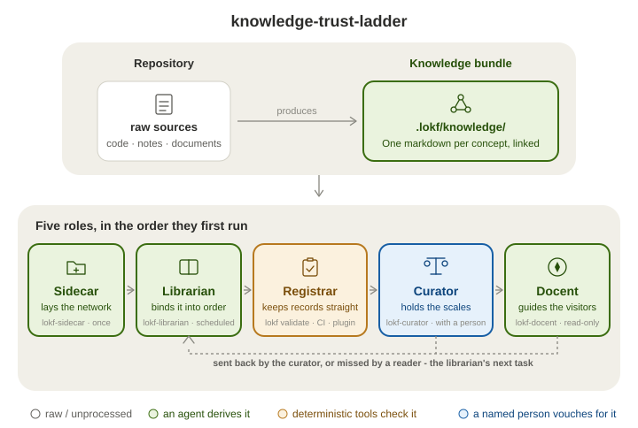
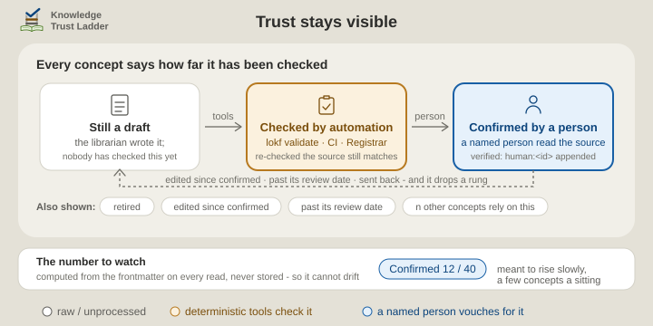

# Knowledge Trust Ladder

> "We lasso the world with networks of silver-coloured Italian hemp,\
> We bind down the world into some sort of order;\
> We balance the earth in a pair of scales of our own devising."\
> — Amy Lowell, *The Congressional Library* (1922)

Four [Agent Skills](https://agentskills.io/home) that turn a repository's scattered knowledge into a maintained, trusted asset using **[LOKF](https://pypi.org/project/lokf/)** (Linked Open Knowledge Format) - [a semantic profile of OKF](https://github.com/GoogleCloudPlatform/knowledge-catalog/blob/main/okf/SPEC.md) whose [specification](https://lokf.nolan-nichols.com/specification/) is a single LinkML file - in which a plain folder of Markdown concept files carries enough meaning to be validated by [the schema](https://github.com/nicholsn/lokf/blob/v0.8.0/lokf.yaml), queried as a graph, and read by people and agents alike. **An agent derives it. Deterministic tools check it. A named person vouches for it. The bundle records which of the three happened to every claim.**

<p align="center">
  
</p>

> **Prefer to ask?** Install the docent skill into any agent you already use - `npx skills add noelmcloughlin/knowledge-trust-ladder --skill lokf-docent --yes` - and ask it about this project. It answers from this repository's own bundle and says how far each answer has been checked. [docs/examples/docent.md](docs/examples/docent.md) shows eight such answers, captured, not invented. **Agents:** if `.lokf/knowledge/index.md` exists, read it first; `llms.txt` says how to weigh it.

## The runtime OKF leaves open

OKF's fourth goal is to "standardize the small set of frontmatter fields that make an agent-maintained corpus **trustable**, without prescribing any runtime" ([SPEC v0.2](https://github.com/GoogleCloudPlatform/knowledge-catalog/blob/main/okf/SPEC.md)). **This is such a runtime.** Those fields become a ladder each claim climbs, a CI gate that refuses a `human:` confirmation no person can be tied to, and an answer that tells its reader how far it has been checked.

It also carries what OKF puts out of scope. "Defining a fixed taxonomy of concept types" and "replacing domain-specific schemas" are non-goals there, and LOKF supplies the mechanism in one flag, `lokf validate --schema`. The practice around it lives here: **when** to reach for a domain schema (the curator's vocabulary-fit line), **who** decides (the team, never an agent), and **how** (the librarian's [recipe](skills/lokf-librarian/references/domain-schema.md)) - which is what turns a domain's own types from knowledge that is merely tolerated into knowledge that is checked.

## Why libraries have catalogues

The knowledge already exists - in code, documents, diagrams, policies, operational records. What's missing is a contextual layer that sits between those sources and consumers, and stays put. Without it, every task starts the same way: find the material, work out how it connects, judge what's still true. That work dies with the task, and the next person, or the next conversation with an assistant, pays for it again.

A **knowledge bundle** - that folder of concept files - is the catalogue: it keeps the work instead of discarding it. But a catalogue is only worth keeping if you can tell which entries are sound. Otherwise you re-verify everything yourself, and the files quietly rot.

So every answer from the bundle says where it came from and how far it has been checked, in plain words: *confirmed by a person*, or *nobody has checked this yet*. The labels are listed under [Trust stays visible](#trust-stays-visible).

## Four roles, three lines of the poem

| Skill | Role | Runs |
| --- | --- | --- |
| [`lokf-sidecar`](skills/lokf-sidecar/SKILL.md) | **Sidecar** - *lays the network*. Bootstraps a fresh `.lokf/` sidecar (tooling, docs, dummy skeleton) into a repository that doesn't have one, from bundled templates; repairs a broken sidecar file. | once |
| [`lokf-librarian`](skills/lokf-librarian/SKILL.md) | **Librarian** - *binds it into order*. Scrapes the repository, derives concepts with their sources, classifies them, wires typed relationships, audits, and hands off for review. Like a real librarian it catalogues without vouching: it deals in *facts about the repository*, never in verdicts about truth. | often, including on a schedule |
| [`lokf-curator`](skills/lokf-curator/SKILL.md) | **Curator** - *holds the scales*. A human curator's assistant. Shows what needs a person's look, puts the source next to the claim, and records the person's verdict - confirm, correct, retire, send back - in the bundle's own frontmatter. It deals in *judgments a person made*, never in facts it derived. | a little, regularly |
| [`lokf-docent`](skills/lokf-docent/SKILL.md) ([examples](docs/examples/docent.md)) | **Docent** - *guides the visitors*, the role the poem leaves implicit, because the library exists for them. Answers from the bundle first, says how far each concept used has been trusted, verifies exact values at the source, and when the bundle has no answer explores the repository and records the miss so it becomes the librarian's next task. Read-only on the bundle. | whenever anyone asks |

**Curator** is the museum sense of the word - the one who authenticates, weighs provenance, and decides what is put on exhibit - not the data-management sense, which is the **librarian**'s job. A **docent** is the museum's guide, who explains the exhibition without moving anything on the shelves.

In short: the **librarian** reports, the **curator** fact-checks and edits, the **docent** reads, and writes back what the bundle missed.

On a fresh repository they run in order: the **sidecar** once, then the **librarian** filling the bundle and marking everything it creates a draft, then the **curator**, where a person turns drafts into confirmed knowledge a few at a time. After that it becomes a loop: the **librarian** refreshes on a schedule, readers send back what the bundle missed, and the **curator** works through whatever that surfaces.

<p align="center">
  
</p>

### Three lines of defence

Regulated industries use the **three lines of defence** to say who owns a risk, who keeps the rules, and who checks independently. The **librarian** and the **curator** are the first line, the **registrar** below is the second, and the bundle ships the evidence a third line would need. [docs/three-lines.md](docs/three-lines.md) places each role, lists what an auditor can check, and answers [the model's critics](docs/three-lines-critics.md).

### The fifth role, which is not a skill

The **registrar** keeps the records themselves in order - each accession documented, its provenance filed, nothing entered in a form the catalogue can't read. No person has to do it: the `lokf` toolkit does it on every change, and CI's [`knowledge-registrar.yaml`](.github/workflows/knowledge-registrar.yaml) does it again on every pull request that touches the bundle, where it also checks that each new confirmation is backed by that person's approval of the pull request or their signature on the commit.

In [Obsidian](https://obsidian.md/) there is no CI, so two plugins do the desk work ([The bundle in Obsidian](docs/obsidian.md)):

| Plugin | Role at the desk |
| --- | --- |
| [LOKF Registrar](https://github.com/noelmcloughlin/obsidian-lokf-registrar) | The **registrar**: checks each record is well-formed as it is typed - the first of the [four levels of checking](docs/for-the-curious.md#four-levels-of-checking), live in the editor. |
| [LOKF Curator](https://github.com/noelmcloughlin/obsidian-lokf-curator) | The **curator**'s assistant, not the curator: puts the source beside the claim and writes down what the person decided - the third level - running this repository's `lokf-curator` review session without an agent in the loop. |

The **curator** is always a person. The skill and the plugin that carry the name are that person's assistants, and neither reaches a verdict of its own.

<p align="center">
  
</p>

## Where the bundle lives

`.lokf/` sits beside the sources it distils - code, notes, documents - in the same tree and almost always the same git repository, the way `.git/` does. The bundle is `.lokf/knowledge/`, one real folder on every host, with a `knowledge_bundle` link beside it for folder pickers that hide dot-folders. Windows, macOS, other forges, no git and synced folders are covered in the sidecar's [portability page](skills/lokf-sidecar/references/portability.md).

## Trust stays visible

Every concept carries its own trust record, and the **curator** reports it in plain words rather than ontology terms:

- **Confirmed by a person** - a named person checked it against its source.
- **Checked by automation only** - automation re-checked that the source still matches; no person has.
- **Nobody has checked this yet** - no check of any kind is recorded.
- **Still a draft**, **edited since a person last confirmed it**, **past its review date**, **retired** - and, for prioritising, how many other concepts rely on each one.

<p align="center">
  
</p>

The labels are computed from the frontmatter on every read, never stored, so they cannot drift from what they describe. The number to watch is **confirmed by a person: n of N**, and it is meant to rise slowly - a handful of concepts in a sitting, cumulative and partial by design. A small, young bundle can reach fully-confirmed quickly; a large or fast-growing one never quite does, and the report says so instead of pretending.

## Install

> Formerly `lokf-agent-skills`. GitHub redirects the old links, clones and
> `npx skills add` paths, so an existing install keeps working; the skill
> names are unchanged.

**Install what you need - each skill stands alone.** The sidecar plus the librarian is enough to see the idea: the bundle gets built, everything in it marked a draft. Add the curator once there is a bundle worth trusting. Already have a healthy `.lokf/`? Skip the sidecar skill. The docent goes anywhere an agent only *reads* a bundle, this repository included.

**What each skill needs.** Every skill runs from a POSIX shell and starts with a preflight that prints what this machine can do and which steps that disables. The sidecar and the librarian need [`uv`](https://docs.astral.sh/uv/) for the `lokf` toolkit; the curator needs this machine signed in to the forge (`gh` or `glab`) to record a confirmation in your name, and signed commits when you open your own curation pull requests ([docs/signing-commits.md](docs/signing-commits.md)); the docent needs nothing. Someone who cannot act on a line the preflight prints - a curator who knows the subject, not the repository - gets a request note for whoever set the repository up, from the sidecar's [prerequisites page](skills/lokf-sidecar/references/prerequisites.md).

**GitHub CLI** ([`gh skill`](https://cli.github.com/manual/gh_skill_install), GitHub CLI v2.90.0+):

```bash
gh skill install noelmcloughlin/knowledge-trust-ladder lokf-sidecar
gh skill install noelmcloughlin/knowledge-trust-ladder lokf-librarian
gh skill install noelmcloughlin/knowledge-trust-ladder lokf-curator
gh skill install noelmcloughlin/knowledge-trust-ladder lokf-docent
```

All four skills release together under one tag, so pin them to the same one: append it to the skill name (`lokf-docent@v0.16.0`) or pass `--pin v0.16.0`.

**Open Skills CLI** ([`npx skills`](https://github.com/vercel-labs/skills)):

```bash
npx skills add noelmcloughlin/knowledge-trust-ladder \
  --skill lokf-sidecar \
  --skill lokf-librarian \
  --skill lokf-curator \
  --skill lokf-docent --yes
```

## For the curious

The sections above are everything you need to decide whether to install these. The mechanics - the four levels of checking and what each proves, which of them the plugins run live, and what to do when a bundle outgrows LOKF's built-in vocabulary - are in [docs/for-the-curious.md](docs/for-the-curious.md).

## Versioning

All four skills ship under one semantic version, `vMAJOR.MINOR.PATCH`, so a set pinned to one tag agrees with itself. What each level means, and how a release is cut: [docs/releasing.md](docs/releasing.md). What changed in each release: [CHANGELOG.md](CHANGELOG.md).

## Contributing

See [CONTRIBUTING.md](CONTRIBUTING.md); the tree is in [docs/repository-layout.md](docs/repository-layout.md). Security issues: see [SECURITY.md](SECURITY.md).

## Credits

- [Nolan Nichols](https://lokf.nolan-nichols.com/), creator of [LOKF](https://lokf.nolan-nichols.com/specification/) (Linked Open Knowledge Format) and its [toolkit](https://github.com/nicholsn/lokf).
- The [LinkML Community](https://linkml.io/), creators of [LinkML](https://linkml.io/linkml/), the schema language LOKF is written in.
- [Google Cloud](https://cloud.google.com/blog/products/data-analytics/how-the-open-knowledge-format-can-improve-data-sharing), creator of the Open Knowledge Format (OKF) specification that LOKF profiles.
- [Andrej Karpathy's LLM Wiki](https://gist.github.com/karpathy/442a6bf555914893e9891c11519de94f), a pattern for building personal knowledge bases with LLMs.

This is an independent project. It is not affiliated with, endorsed by, or an
official distribution of LOKF or of the Open Knowledge Format. "LOKF" and
"Linked Open Knowledge Format" refer to the format and toolkit published by
Nolan Nichols; "OKF" and "Open Knowledge Format" to the specification
published by Google Cloud. Both are used here as descriptors, under their own
open terms.

## License

[Apache License 2.0](LICENSE).
