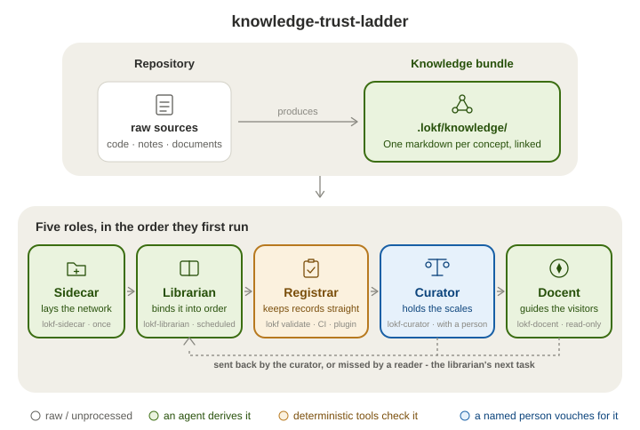
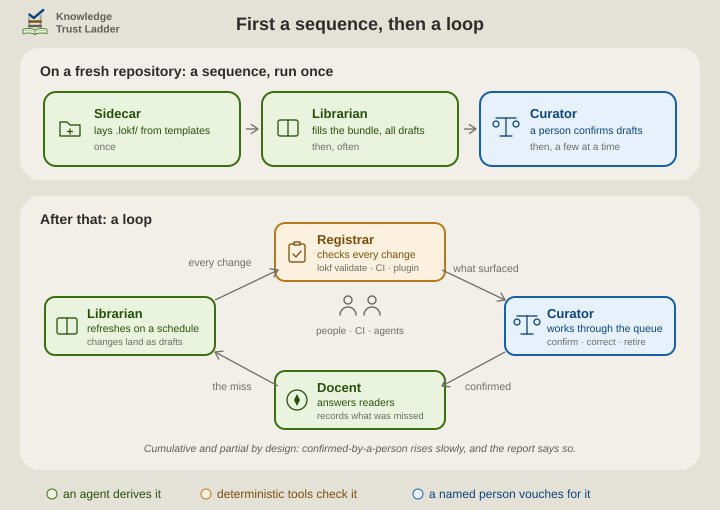
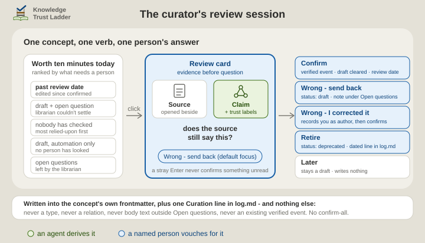
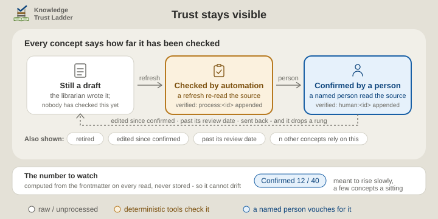

<picture>
  <source media="(prefers-color-scheme: dark)" srcset=".assets/knowledge-trust-ladder-logo-dimmed.svg">
  
</picture>

# Knowledge Trust Ladder (ktl)

> "We lasso the world with networks of silver-coloured Italian hemp,\
> We bind down the world into some sort of order;\
> We balance the earth in a pair of scales of our own devising."\
> — Amy Lowell, *The Congressional Library* (1922)

Knowledge Trust Ladder keeps a repository's scattered knowledge as a **collection**: catalogued, authenticated and explained, with the trust in every claim left visible. Four [Agent Skills](https://agentskills.io/home) build and keep it. Registrar automation serves the desk, checking every record and guarding every confirmation in CI on each pull request. The [toolkit](https://pypi.org/project/lokf) underneath supplies the schema and the tooling. Two [Obsidian](https://obsidian.md/) plugins are optional, for a desk with no CI.

**An agent derives it. Deterministic tools check it. A named person vouches for it. The bundle records which of the three happened to every claim.**

<p align="center">
  <picture>
    <source media="(prefers-color-scheme: dark)" srcset=".assets/knowledge-trust-ladder-card-dimmed.svg">
    
  </picture>
</p>

> **Prefer to ask?** `npx skills add noelmcloughlin/knowledge-trust-ladder --skill ktl-docent --yes` installs the docent into any agent you already use. Ask it about this project, and it answers from this repository's own bundle, saying how far each answer has been checked. See [eight captured answers](docs/examples/docent.md). **Agents:** if `.lokf/knowledge/index.md` exists, read it first. `llms.txt` says how to weigh it.

## Why libraries have catalogues

The knowledge already exists: in code, documents, diagrams, policies, operational records. What's missing is a **context layer**: a governed layer between those sources and whoever consumes them, a person or an agent, that stays put. Without it every task starts the same way: find the material, connect it, judge what's still true. The next person or assistant pays for that work again.

A **knowledge bundle** is the catalogue: a plain folder of Markdown concept files that keeps the work instead of discarding it. It earns its keep when a reader can tell which entries are sound, which comes back to one question: *who is responsible for the quality of this context?* The trust ladder is the answer, written into each entry. Every concept says where it came from and how far it has been checked, in plain words: *confirmed by a person*, or *nobody has checked this yet*. The labels are under [Trust stays visible](#trust-stays-visible).

## Prose, Structure, Meaning, Tools

A bundle is prose a person reads, structure a schema checks, meaning a graph can query, and tools that come with the standard rather than with this project. **Specification first, schema first, interoperability first.** The bundle is written in **[LOKF](https://pypi.org/project/lokf/)** (Linked Open Knowledge Format), [a semantic profile of OKF](https://github.com/GoogleCloudPlatform/knowledge-catalog/blob/main/okf/SPEC.md) whose [specification](https://lokf.nolan-nichols.com/specification/) is [a single LinkML schema](https://github.com/nicholsn/lokf/blob/v0.8.0/lokf.yaml). A folder of Markdown can therefore be validated, queried as a graph, and read by people, agents and any tool that speaks OKF, JSON Schema, JSON-LD, SHACL or [another supported format](https://linkml.io/linkml/generators/index.html).

**Knowledge Trust Ladder is an OKF runtime.** OKF's fourth goal is to "standardize the small set of frontmatter fields that make an agent-maintained corpus **trustable**, without prescribing any runtime". Here those frontmatter fields do the work: they are the rungs a claim climbs, the gate that refuses a `human:` confirmation no person can be tied to, and the answer that says how far a claim has been checked.

**LOKF supplies the taxonomy, and a domain can extend it.** OKF leaves "a fixed taxonomy of concept types" to the producer, so any domain can bring its own. LOKF's is a short list of classes, and a domain whose concepts stop fitting it extends the schema in LinkML, so its own types go from tolerated to checked ([when the vocabulary stops fitting](skills/ktl-curator/references/domain-schemas.md)).

**Measuring the same loop.** [WikiSkill](https://arxiv.org/abs/2608.27454) (Google Research) has an agent compile its own experience into a persistent wiki and finds that wiki "critical" to the skills evolved from it. A bundle runs that loop under a schema, with a registrar around it and a named person's verdict where the paper has a score ([docs/wikiskill.md](docs/wikiskill.md)).

## Four skills, three lines of the poem

| Skill | Role | Runs |
| --- | --- | --- |
| [`ktl-sidecar`](skills/ktl-sidecar/SKILL.md) | **Sidecar**, *lays the network*. Lays down `.lokf/` from bundled templates, a dot-folder beside the code like `.git/`: tooling, docs, a dummy skeleton at `.lokf/knowledge/`, and a `knowledge_bundle` link for folder pickers that hide dot-folders. Repairs a broken sidecar file. Its [portability page](skills/ktl-sidecar/references/portability.md) covers Windows, macOS, other forges, no git and synced folders. | once |
| [`ktl-librarian`](skills/ktl-librarian/SKILL.md) | **Librarian**, *binds it into order*. Scrapes the repository, derives concepts with their sources, classifies them, wires typed relationships, audits, and hands off for review. Like a real librarian it catalogues without vouching: *facts about the repository*, never verdicts about truth. | often, including on a schedule |
| [`ktl-curator`](skills/ktl-curator/SKILL.md) | **Curator**, *holds the scales*. A person's assistant. It shows what needs a look, puts the source next to the claim, and records the verdict (confirm, correct, retire, send back) in the bundle's own frontmatter. *Judgments a person made*, never facts it derived. | a little, regularly |
| [`ktl-docent`](skills/ktl-docent/SKILL.md) ([examples](docs/examples/docent.md)) | **Docent**, *guides the visitors*, the role the poem leaves implicit, because the collection exists for them. Answers from the bundle and labels how far each concept has been trusted. Checks exact values at the source. When the bundle has no answer it explores the repository and records the miss, which becomes the librarian's next task. Read-only on the bundle. | whenever anyone asks |

**Curator** is the museum sense, the one who authenticates, weighs provenance and decides what goes on exhibit. It is not the data-management sense, which is the **librarian**'s job. A **docent** is the museum's guide, who explains the exhibition without moving anything on the shelves.

On a fresh repository they run in order: **sidecar**, then **librarian** filling the bundle with drafts, then **curator**, where a person turns drafts into confirmed knowledge a few at a time. After that it is a loop: the **librarian** refreshes on a schedule, readers send back what the bundle missed, and the **curator** works through whatever that surfaces.

<p align="center">
  <picture>
    <source media="(prefers-color-scheme: dark)" srcset=".assets/ktl-lifecycle-loop-dimmed.svg">
    
  </picture>
</p>

### The fifth role, which is not a skill

The **registrar** keeps the records themselves in order: each accession documented, its provenance filed, nothing entered in a form the catalogue can't read. No person has to do it: the `lokf` toolkit checks every change, and CI's [`knowledge-registrar.yaml`](.github/workflows/knowledge-registrar.yaml) checks every pull request that touches the bundle. There it also ties each confirmation that is added or removed to that person's approval or their signed commit.

At the librarian's desk the registrar is `knowledge-apply.sh`, the only pen. The librarian describes each change as an operation, and the script writes the record, stamps its provenance, keeps the index in step, and refuses one that would forge or remove a confirmation. At the reader's desk and the curator's it is `knowledge-report.sh`, which computes each trust label and the bundle's health line, so that neither is a model's arithmetic. These are the deterministic tools of the opening line: a check gives the same answer every time, which neither the librarian nor the curator can promise.

In [Obsidian](https://obsidian.md/) there is no CI, so two optional plugins do the registrar's work at the desk. [KTL Registrar](https://github.com/noelmcloughlin/obsidian-ktl-registrar) checks each record as it is typed, and [KTL Curator](https://github.com/noelmcloughlin/obsidian-ktl-curator) runs this repository's `ktl-curator` review session with no agent in the loop ([The bundle in Obsidian](docs/obsidian.md)).

In the **three lines of defence** that regulated industries use, the librarian and the curator are the first line, the registrar the second, and the bundle ships the evidence a third line would need ([docs/three-lines.md](docs/three-lines.md)).

The **curator** is always a person. The skill and the plugin that carry the name are that person's assistants, and neither reaches a verdict of its own.

<p align="center">
  <picture>
    <source media="(prefers-color-scheme: dark)" srcset=".assets/ktl-review-session-dimmed.svg">
    
  </picture>
</p>

### The fifth skill, which is not a role

[`ktl-prose`](skills/ktl-prose/SKILL.md) is the **librarian**'s copy editor. It rewords what an agent wrote, in plain English, before a person confirms it. It changes the wording and never a fact, it leaves every byte of frontmatter alone, and it never touches a concept a person wrote or confirmed. It is optional, and the roles above lose nothing without it.

## Trust stays visible

Every concept carries its own trust record, and the **curator** reports it in plain words:

- **Confirmed by a person**: a named person checked it against its source.
- **Checked by automation only**: automation re-checked that the source still matches; no person has.
- **Nobody has checked this yet**: no check of any kind is recorded.
- **Still a draft**, **edited since a person last confirmed it**, **past its review date**, **retired**; and, for prioritising, how many other concepts rely on each one.

<p align="center">
  <picture>
    <source media="(prefers-color-scheme: dark)" srcset=".assets/trust-ladder-dimmed.svg">
    
  </picture>
</p>

The labels are computed from the frontmatter on every read, never stored, so they cannot drift from what they describe. The number to watch is **confirmed by a person: n of N**. It is meant to rise slowly, a handful of concepts in a sitting.

## Install

Each skill stands alone. The sidecar plus the librarian is enough to see the idea:

```bash
npx skills add noelmcloughlin/knowledge-trust-ladder \
  --skill ktl-sidecar --skill ktl-librarian --yes
```

Add the curator once there is a bundle worth trusting. The docent goes anywhere an agent only *reads* one. `ktl-prose` is optional and installs the same way. **[docs/install.md](docs/install.md)** gives the `gh skill` equivalents, what each skill needs on the machine, and how to pin a set to one release. Microsoft 365 Copilot gets the docent as a zip each release carries: **[docs/m365.md](docs/m365.md)**.

**Claude Code plugin** (the same five skills as one plugin, with keywords a plugin catalog can search):

```text
/plugin marketplace add noelmcloughlin/knowledge-trust-ladder
/plugin install knowledge-trust-ladder@knowledge-trust-ladder
```

## Read on

| | |
| --- | --- |
| The mechanics: the four levels of checking, which the plugins run live, and what to do when a bundle outgrows LOKF's vocabulary | [docs/for-the-curious.md](docs/for-the-curious.md) |
| The bundle in Obsidian, and the two plugins | [docs/obsidian.md](docs/obsidian.md) |
| Where each role sits in the three lines of defence, and [the model's critics](docs/three-lines-critics.md) | [docs/three-lines.md](docs/three-lines.md) |
| WikiSkill, a 2026 paper on agent-maintained wikis, set beside this design part by part: the same loop, with a score there and a person here | [docs/wikiskill.md](docs/wikiskill.md) |
| Versioning: all five skills ship under one `vMAJOR.MINOR.PATCH`, so a set pinned to one tag agrees with itself | [docs/releasing.md](docs/releasing.md), [CHANGELOG.md](CHANGELOG.md) |
| Contributing, the repository tree, and reporting a security issue | [CONTRIBUTING.md](CONTRIBUTING.md), [docs/repository-layout.md](docs/repository-layout.md), [SECURITY.md](SECURITY.md) |

## Credits

- [Nolan Nichols](https://lokf.nolan-nichols.com/), creator of [LOKF](https://lokf.nolan-nichols.com/specification/) (Linked Open Knowledge Format) and its [toolkit](https://github.com/nicholsn/lokf).
- The [LinkML Community](https://linkml.io/), creators of [LinkML](https://linkml.io/linkml/), the schema language LOKF is written in.
- [Google Cloud](https://cloud.google.com/blog/products/data-analytics/how-the-open-knowledge-format-can-improve-data-sharing), creator of the Open Knowledge Format (OKF) specification that LOKF profiles.
- [Andrej Karpathy's LLM Wiki](https://gist.github.com/karpathy/442a6bf555914893e9891c11519de94f), a pattern for building personal knowledge bases with LLMs.
- [WikiSkill](https://arxiv.org/abs/2608.27454) by Tang et al. (Google Research, 2026), the paper on agent-maintained wikis that [docs/wikiskill.md](docs/wikiskill.md) reads against this design.

This is an independent project. It is not affiliated with, endorsed by, or an
official distribution of LOKF or of the Open Knowledge Format. "LOKF" and
"Linked Open Knowledge Format" refer to the format and toolkit published by
Nolan Nichols; "OKF" and "Open Knowledge Format" to the specification
published by Google Cloud. Both are used here as descriptors, under their own
open terms.

## License

[Apache License 2.0](LICENSE).
