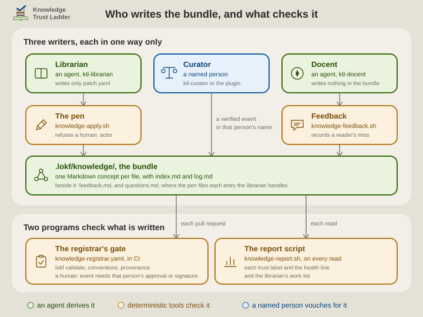

# For the curious: how a claim gets checked, and where the vocabulary ends

[The README](../README.md) says everything you need to decide whether to install these skills. What follows is the mechanics: who writes the bundle and what checks each write, exactly what "confirmed by a person" is standing on, and what to do when a bundle outgrows the built-in vocabulary.

## Who writes the bundle, and what checks it

Three roles write to the bundle, each in one way only, and programs check every write.

- **The librarian**, an agent, writes one file: `.lokf/patch.yaml`, a list of operations. `knowledge-apply.sh` applies it, and is called *the pen* because the librarian writes the bundle only through it. The pen writes each concept, stamps `generated` from the clock, keeps the two index bullets equal to the concept's `description`, and files the line in `log.md`. It refuses a `human:` actor, a rewrite of text a person wrote, and the deletion of a concept a person confirmed. On the scheduled run, the wrapper refuses a run in which the agent wrote any other file.
- **The curator**, a named person, writes the verdicts through `ktl-curator` or the KTL Curator plugin. A verdict is a `verified` event in that person's name, or a change of `status` or review date, with one line in `log.md`.
- **The docent**, an agent, writes nothing in the bundle. `knowledge-feedback.sh` records what a reader missed in `.lokf/feedback.md`, and the pen moves each entry the librarian handles into `.lokf/questions.md`.

On GitHub, every change reaches the default branch as a pull request. There the registrar's gate, `knowledge-registrar.yaml`, runs `lokf validate`, the conventions script and the `provenance` job. That job accepts a `human:` event that a change adds or removes only with that person's approval of the pull request or their signature on the commit. No trust label is stored: `knowledge-report.sh` computes each one from the frontmatter on every read, for the docent's answers, the curator's report and the librarian's work list.

  <picture>
    <source media="(prefers-color-scheme: dark)" srcset="../.assets/ktl-architecture-dimmed.svg">
    
  </picture>

## Four levels of checking

Each proves less than its name suggests. Only the third yields a claim someone has agreed to stand behind.

| Check | Who, when | What it proves | What it can't |
| --- | --- | --- | --- |
| Schema-valid | the `lokf` toolkit on every change (`just lokf-validate`, and `just lokf-check-refs` for relation targets); `lokf validate` again as the CI gate on every pull request that touches the bundle | the frontmatter is well-formed, the types and relations are ones the schema knows, and every typed relation points at a concept that exists | that anything in it is true |
| Source-consistent | `ktl-librarian` on every scheduled refresh, starting from the sources `knowledge-report.sh` finds have moved; shown as *checked by automation only* | the concept still matches what its source says today | that the source is right, or that the concept says what the team means |
| Human-confirmed | a named person, through `ktl-curator` or the KTL Curator plugin, shown as *confirmed by a person* | someone accountable read the source and agreed | that it stays true, which is what review dates are for |
| Proven in use | readers, through `ktl-docent`, which records misses and disagreements in `.lokf/feedback.md`; and, where the retrieval score is switched on, `knowledge-report.sh` on each scheduled refresh | the bundle answered a real question, or didn't, and the gap became the librarian's next task; the score says whether the index still leads to the concept behind each question readers asked | nothing further: this is the feedback loop that feeds the other three |

The first and third rows also run live, outside these skills and the CLI, for anyone maintaining a bundle in Obsidian rather than through an agent. That is the KTL Registrar plugin for the first and the KTL Curator plugin for the third: see [the fifth role](../README.md#the-fifth-role-which-is-not-a-skill).

## When the vocabulary stops fitting

LOKF's vocabulary is a short list of classes and typed relations. It is kept small, which is what keeps bundles portable. When concepts stop fitting those classes, it is typically in a deep or safety-critical domain: medicine, law, finance, safety engineering. The answer is a domain schema written in [LinkML](https://linkml.io) that extends LOKF's, not a looser bundle. The **curator** flags the drift; the team decides; the **librarian** applies it.

[`ktl-curator/references/domain-schemas.md`](../skills/ktl-curator/references/domain-schemas.md) says what it costs (no new tooling) and how to write one. It also says what to do when the domain already has a LinkML vocabulary of its own, and how to validate values it binds to an external domain ontology. [`ktl-librarian/references/domain-schema.md`](../skills/ktl-librarian/references/domain-schema.md) gives the recipe that writes one and validates against it with the toolkit you already have.
