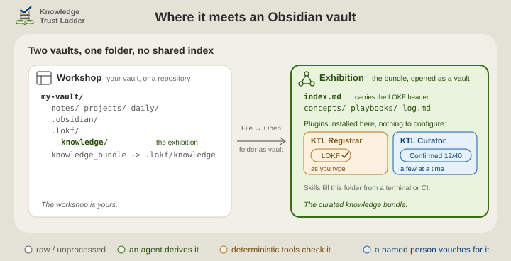

# The bundle in Obsidian

[The README](../README.md) says where a bundle lives and which two plugins do the **registrar**'s and the **curator**'s desk work. This page is for the people who open the bundle in Obsidian: what to open, what to install there, and where the rest is written down.

## Two vaults

The vault you already have is the **workshop**, and nothing in it is moved or migrated. The bundle is the **exhibition**: the checked part of what the workshop knows, and the front door teammates, CI and agents come through. It opens as a small vault of its own, and the two never index the same file.

<p align="center">
  <picture>
    <source media="(prefers-color-scheme: dark)" srcset="../.assets/ktl-two-vaults-dimmed.svg">
    
  </picture>
</p>

1. **File → Open folder as vault**, and pick `knowledge_bundle` at the root of the host, the repository or vault the bundle sits in. That link is the doorway: `ktl-sidecar` lays it beside the sidecar, the `.lokf/` folder, so the bundle has a name a folder picker can see. Open the link itself, never the host root: a vault opened at the root lists neither the dot-folder nor the link, which is exactly what keeps the workshop clean.
2. **Install the plugins in that vault.** Obsidian installs plugins per vault. Nothing to configure: the root `index.md` carries the bundle's header, so the whole vault is the bundle.
3. **Edit and confirm there.** Obsidian writes that vault's workspace state through the link into `.lokf/knowledge/.obsidian/`, which the sidecar's `.gitignore` already excludes.

`knowledge_bundle` can be missing: a sync service dropped it, or a Windows checkout without `core.symlinks` shows it as a small text file. In that case open `.lokf/knowledge` by typing the path into the picker, or make the link once from the host root:

```bash
ln -s .lokf/knowledge knowledge_bundle      # or `just lokf-link` from .lokf/
```

```bat
mklink /J knowledge_bundle .lokf\knowledge   # Windows: a junction, no administrator rights
```

## Plugin for skill

Obsidian is optional in both directions. The skills rely on `lokf validate`, not on a plugin. The plugins work on any LOKF bundle however it was made, and a vault with no bundle in it is left alone.

The two fit without adaptation, for two reasons. A bundle is a folder of Markdown notes with a few properties each, which is exactly what Obsidian edits. And the people who confirm knowledge are often not the people who run agents or terminals. For them a plugin in an editor they already use is the desk, and a prompt is not.

| Role | Skill or tool | Obsidian plugin |
| --- | --- | --- |
| **Sidecar** | `ktl-sidecar` | - |
| **Librarian** | `ktl-librarian` | none (deriving is an agent's job) |
| **Registrar** | `lokf validate`, `knowledge-registrar.yaml` | [KTL Registrar](https://github.com/noelmcloughlin/obsidian-ktl-registrar): the same checks, as you type |
| **Curator**, always a person | `ktl-curator`, the person's assistant | [KTL Curator](https://github.com/noelmcloughlin/obsidian-ktl-curator): the same assistant, at the desk |
| **Docent** | `ktl-docent`, `lokf serve` | - |

## Where the bundle lives, host by host

The skills lay down one layout everywhere: `.lokf/knowledge/` is the real folder, and `knowledge_bundle` beside it is a link, a junction on Windows, so that folder pickers, which hide dot-folders, have a name to open. Where the host's folder sits decides what a plugin can reach from the bundle's vault, and what syncs.

- **A code repository.** The **librarian** derives the bundle from code and docs, and you check it in `knowledge_bundle` opened as a vault. Concepts cite sources that sit above that small vault, such as `src/…` and `docs/…`, so no plugin can open them from there. KTL Curator shows such a source as a path with a copy button and says it cannot open it.
- **Your vault, kept in git.** Run the skills at the host and the sidecar lands beside your notes. `.lokf/` is a dot-folder your vault never indexes, and the doorway link resolves inside the vault, so Obsidian skips that too. Your main vault never sees the bundle, and you curate in a second vault opened through the doorway. One repository, not two: the bundle travels with the notes it was distilled from. Splitting it into a repository of its own is a later choice for a team, never a starting one.
- **A shared drive or a SharePoint library.** The sidecar is files and syncs as files; Microsoft's list of restricted OneDrive and SharePoint names has nothing against a leading dot. OneDrive syncs neither symbolic links nor junctions, so the doorway is made per machine with `just lokf-link` in `.lokf/`, or the bundle is opened by path. A team that wants a synced, visible folder may rearrange by hand, with a real `knowledge_bundle/` and `.lokf/knowledge` linking onto it; the sidecar's [`portability.md`](../skills/ktl-sidecar/references/portability.md) says how. Both plugins then detect the folder as a bundle inside a vault (*Which folder is the bundle* in either README), with the same cost if the shared folder is also a vault.
- **Many hosts, one vault.** Obsidian follows a link whose target lies outside the vault. Link each repository's `.lokf/knowledge` into a folder of your own vault (`projects/acme-knowledge → ~/git/acme/.lokf/knowledge`) and list those folders under the plugins' *Bundle root folders* setting. Every bundle you curate is then in one vault, beside the notes you keep about them, and the sources sit inside the vault, so KTL Curator can open them beside the claim. This is the one arrangement that puts exhibits in your vault's index, with the cost the plugin READMEs name. Keep such links out of Obsidian Sync, which does not carry them.

## Where the rest is written

- **Using each plugin**: the status bar, the report, the review card and the commands are in the plugin READMEs, [KTL Registrar](https://github.com/noelmcloughlin/obsidian-ktl-registrar#readme) and [KTL Curator](https://github.com/noelmcloughlin/obsidian-ktl-curator#readme).
- **What Obsidian's file reconciler does with the link on each host** is in this repository's playbook [Open the knowledge bundle in Obsidian](../.lokf/knowledge/playbooks/open-bundle-in-obsidian.md), which also says why the bundle is never laid down inside a vault as a folder rather than a link. [Hosts and doorways](../.lokf/knowledge/explanation/hosts-and-doorways.md) records why there is one layout.
- **Shared folders, Windows, and hosts without git** are in the sidecar's [`portability.md`](../skills/ktl-sidecar/references/portability.md).
- **An agent asked the same question** answers from [`ktl-docent/references/obsidian.md`](../skills/ktl-docent/references/obsidian.md), which says the same in fewer words.
