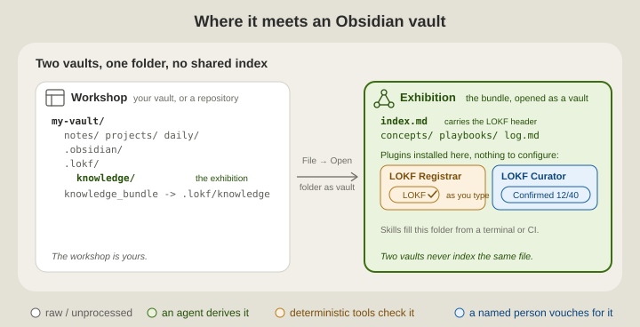

# The bundle in Obsidian

[The README](../README.md) says where a bundle lives and which two plugins do the **registrar**'s and the **curator**'s desk work. This page is for the people who open the bundle in Obsidian: what to open, what to install there, and where the rest is written down.

Obsidian is optional in both directions. The skills rely on `lokf validate`, not on a plugin, and the plugins work on any LOKF bundle however it was made; a vault with no bundle in it is left alone. The two fit without adaptation because a bundle is a folder of Markdown notes with a few properties each, which is exactly what Obsidian edits - and because the people who confirm knowledge are often not the people who run agents or terminals. For them a plugin in an editor they already use is the desk, and a prompt is not.

## Two vaults

The vault you already have is the **workshop**, and nothing in it is moved or migrated. The bundle is the **exhibition**: the checked part of what the workshop knows, and the front door teammates, CI and agents come through. It opens as a small vault of its own, and the two never index the same file.

<p align="center">
  
</p>

1. **File → Open folder as vault**, and pick `knowledge_bundle` at the host root - the link `lokf-sidecar` lays beside `.lokf/` so the bundle has a name a folder picker can see. Open the link itself, never the host root: a vault opened at the root lists neither the dot-folder nor the link, which is exactly what keeps the workshop clean.
2. **Install the plugins in that vault.** Obsidian installs plugins per vault. Nothing to configure: the root `index.md` carries the bundle's header, so the whole vault is the bundle.
3. **Edit and confirm there.** Obsidian writes that vault's workspace state through the link into `.lokf/knowledge/.obsidian/`, which the sidecar's `.gitignore` already excludes.

If `knowledge_bundle` is missing - a sync service dropped it, or a Windows checkout without `core.symlinks` shows it as a small text file - open `.lokf/knowledge` by typing the path into the picker, or make the link once from the host root:

```bash
ln -s .lokf/knowledge knowledge_bundle      # or `just lokf-link` from .lokf/
```

```bat
mklink /J knowledge_bundle .lokf\knowledge   # Windows: a junction, no administrator rights
```

## Plugin for skill

| Role | Skill or tool | Obsidian plugin |
| --- | --- | --- |
| **Sidecar** | `lokf-sidecar` | - |
| **Librarian** | `lokf-librarian` | - (deriving is an agent's job) |
| **Registrar** | `lokf validate`, `knowledge-registrar.yaml` | [LOKF Registrar](https://github.com/noelmcloughlin/obsidian-lokf-registrar) - the same checks, as you type |
| **Curator** - always a person | `lokf-curator`, the person's assistant | [LOKF Curator](https://github.com/noelmcloughlin/obsidian-lokf-curator) - the same assistant, at the desk |
| **Docent** | `lokf-docent`, `lokf serve` | - |

## Where the rest is written

- **Using each plugin** - the status bar, the report, the review card, the commands - is in the plugin READMEs: [LOKF Registrar](https://github.com/noelmcloughlin/obsidian-lokf-registrar#readme) and [LOKF Curator](https://github.com/noelmcloughlin/obsidian-lokf-curator#readme).
- **What Obsidian does with the link on each host**, why the bundle is never laid down as a real folder inside a vault, and the one arrangement that does put exhibits in the workshop (a link from your vault to a repository's bundle, listed under the plugins' *Bundle root folders* setting): this repository's playbook [Open the knowledge bundle in Obsidian](../.lokf/knowledge/playbooks/open-bundle-in-obsidian.md). [Hosts and doorways](../.lokf/knowledge/explanation/hosts-and-doorways.md) records why there is one layout.
- **Shared folders, Windows, and hosts without git** are in the sidecar's [`portability.md`](../skills/lokf-sidecar/references/portability.md).
- **An agent asked the same question** answers from [`lokf-docent/references/obsidian.md`](../skills/lokf-docent/references/obsidian.md), which says the same in fewer words.
