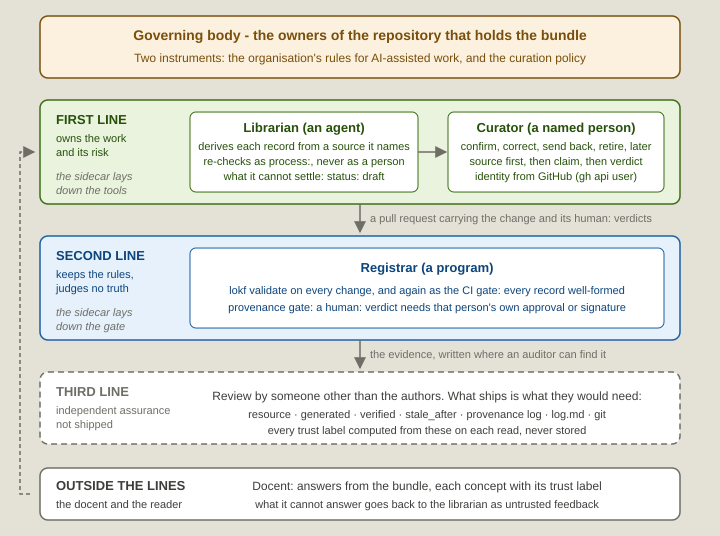

# Three lines of defence: where each LOKF role sits, and what an auditor can check

Regulated industries use the **three lines of defence** to say who owns a risk, who keeps the rules, and who checks independently. The reference version is the Three Lines Model of The Institute of Internal Auditors (IIA), [updated in 2020](https://www.theiia.org/en/content/position-papers/2020/the-iias-three-lines-model-an-update-of-the-three-lines-of-defense/) and reissued as a [Statement of Position](https://www.theiia.org/globalassets/site/resources/statements-of-position/tlm_assurance_advice_support_effective_gov_en.pdf) in 2026. LOKF was not built to it, but each role fits, and this page answers the three questions a governance reader brings: who is accountable for a claim, what a machine checks, and what can be examined afterwards. Every control named here already exists in a LOKF bundle.

| Line | In the model | In a LOKF bundle |
| --- | --- | --- |
| **First** - owns the work and its risk | operational management | The **librarian** derives every record from a source it names, records its own re-checks as `process:` and never as a person, and marks what it cannot settle `status: draft` with an open question. The **curator**, a named person, decides what the team accepts as true: confirm, correct, send back, retire, or leave for later. Maker and checker: the agent cannot vouch, and the person does not derive. |
| **Second** - ensures compliance, without owning the content | risk and compliance functions | The **registrar**: `lokf validate` on every change and again as the CI gate, and the LOKF Registrar plugin in Obsidian, keep every record well-formed; the gate's `provenance` job ties each new `human:` verdict to that person's approval of the pull request or their signature on the commit. It never judges truth: a verdict is only ever what that person said. |
| **Third** - independent assurance | internal audit | The **bundle** ships the evidence an independent reviewer needs, listed below, and not the review, because assurance is independent only when it comes from someone other than the authors. |

  

The **docent** sits outside the lines, where the reader does, and reports what it could not answer back to the librarian as untrusted input. The **sidecar** lays down the tools and the gate.

Above the lines sits a governing body: for a bundle, the owners of the repository that holds it. Their two instruments are the organisation's rules for AI-assisted work (this project's are its [AI covenant](../AI_COVENANT.md)) and the curation policy, a concept in the bundle that says who curates and how often each kind of concept is re-confirmed, itself reviewed like any other concept. The [four levels of checking](for-the-curious.md#four-levels-of-checking) are these same checks ordered by when they happen.

## Lines are roles, not people

The IIA's own text says the lines "are not intended to denote structural elements but a useful differentiation in roles", and that roles "may overlap in practice" given "clear accountability, transparency, and safeguards to preserve objectivity and avoid self-review risks". A bundle does not decide who plays each line; the organisation that adopts it does, one person or a department per line.

The tooling holds the lines apart either way. The **curator**'s identity comes from the forge, never from the person: the login this machine is signed in as, or the login under which the forge lists the key the person signs with; never git config, which anyone can edit, and never what the person types into the agent's chat. The gate accepts a `human:` verdict only on that person's approval of the pull request or their signature on the commit. Where an organisation lets one person both author and confirm, the signature is the route, since GitHub will not let them approve their own pull request; an Environment with required reviewers is the one logged exception.

## What an auditor can check

Every trust label is computed from the frontmatter on each read and never stored, so a label cannot be asserted, only earned. Each question an auditor asks has a place where the answer is written:

| Question | Where the answer is |
| --- | --- |
| Where did this come from? | `resource`, `sources[].resource`, `derivedFrom` |
| Who produced the current text, and when? | `generated.by`, `generated.at` |
| Who confirmed it, and when? | `verified[].by`, `verified[].at` |
| Which state of the source was the check made against? | `verified[].revision` and `generated.revision`, proposed for lokf 0.9.0 and not yet released: the commit hash of a file, which the gate resolves against the tree, or an ETag or digest for a URL, which nothing checks. Absent means unrecorded, never unchanged |
| Was that really them? | the `provenance` job's log on the pull request - the forge's verdict on the approval or the signature, not the runner's; locally, the curator skill's *Not tied to a signed commit* count |
| When must it be looked at again, and by what rule? | `stale_after`, proposed from `policies/knowledge-curation.md` |
| What changed, and why? | `log.md`, and git |
| Is the checker independent of the checked? | the JSON Schema and SHACL shapes are generated from the upstream `lokf.yaml`, not written by the bundle's authors; the bundle projects to RDF and answers [SPARQL](../skills/lokf-curator/references/queries.md) |

Four limits on what that evidence shows:

- A confirmation records who and when. Which state of the source, only when the event carries `revision`, and even then the state the skill fetched, not what the person read.
- The gate checks identity, not entitlement: that `human:ada` is ada, not that ada was the right person. A repository carrying `.lokf/curators/` settles who may confirm at all; which kinds of concept each may confirm is still the curation policy's prose.
- An Environment attestation records only that a listed reviewer clicked Approve, not that they opened the source.
- The `provenance` job runs on GitHub. Elsewhere `knowledge-provenance.sh` checks signatures against the keys on file and nothing checks approvals; a host without git has only its platform's version history.

## What the critics say

The model has critics, and so has the kind of tool a bundle is: a machine's output checked by a person. [Critics of the Three Lines Model](three-lines-critics.md) quotes them from their own texts and sets against each what a bundle answers and what it leaves open.

## What remains to do, and who does it

- **Upstream.** OKF adopting `revision` ([knowledge-catalog#437](https://github.com/GoogleCloudPlatform/knowledge-catalog/issues/437)), and LOKF's 0.9.0 shipping it.
- **This project.** `revision` written by the LOKF Curator plugin; an entitlement check by kind of concept; the approval half of the gate on GitLab and Forgejo; an auditor skill for the third line, of which the curator's sampling step is the first half.
- **The organisation's.** Naming the independent re-checker, whether a red check blocks a merge, and the incentives and skill of whoever curates.
